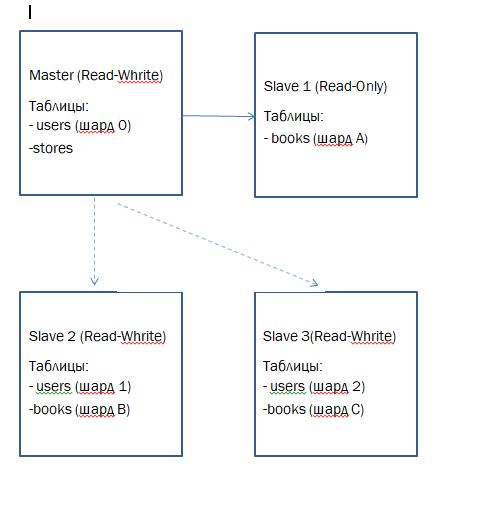

## Домашнее задание к занятию «Репликация и масштабирование. Часть 2» - Пищук Наталья
### Задание 1
Опишите основные преимущества использования масштабирования методами:

активный master-сервер и пассивный репликационный slave-сервер;
master-сервер и несколько slave-серверов;
Дайте ответ в свободной форме.

## Ответ
### Активный master-сервер и пассивный репликационный slave-сервер
#### Преимущества архитектуры:
- Отказоустойчивость. При выходе из строя master-сервера, slave может взять на себя его функции, обеспечивая непрерывность работы системы.
- Резервное копирование. Slave-сервер постоянно содержит актуальную копию данных, что упрощает процесс резервного копирования.
- Снижение нагрузки. Часть операций чтения может быть перенесена на slave, разгружая master.
- Простота реализации. Архитектура относительно проста в настройке и обслуживании.
- Синхронизация данных. Данные между серверами синхронизируются в реальном времени или с минимальной задержкой.

### Master-сервер и несколько slave-серверов
#### Преимущества архитектуры:
- Высокая производительность. Распределение нагрузки чтения между несколькими slave-серверами значительно увеличивает общую производительность системы.
- Масштабируемость. Легкое добавление новых slave-серверов при росте нагрузки.
- Гибкость. Возможность назначения разным slave-серверам различных задач (аналитика, отчеты, резервное копирование).
- Балансировка нагрузки. Эффективное распределение запросов чтения между slave-серверами.
- Повышенная доступность. Даже при выходе из строя одного или нескольких slave-серверов система продолжает работать.
- Географическое распределение. Возможность размещения slave-серверов в разных регионах для локального доступа к данным.

### Вывод
Использование репликации позволяет повысить отказоустойчивость, распределить нагрузку и улучшить производительность системы. Один slave подходит для базовых сценариев, а несколько slave-серверов — для высоконагруженных систем с большим количеством запросов на чтение.

### Задание 2
Разработайте план для выполнения горизонтального и вертикального шаринга базы данных. База данных состоит из трёх таблиц:

- пользователи,
- книги,
- магазины (столбцы произвольно). Опишите принципы построения системы и их разграничение или разбивку между базами данных.
Пришлите блоксхему, где и что будет располагаться. Опишите, в каких режимах будут работать сервера.

### Решение
План горизонтального и вертикального шардинга базы данных

База данных:

Рассмотрим таблицы со следующим набором данных
- Пользователи (users) – id, name, email, registration_date
- Книги (books) – id, title, author, price, store_id
- Магазины (stores) – id, name, location

Горизонтальный шардинг используется для распределения данных по нескольким серверам, уменьшая нагрузку на отдельные серверы и обеспечивая их масштабируемость.
Вертикальный шардинг подразумевает разделение таблиц или групп столбцов на разные серверы, чтобы распределить нагрузку на чтение и запись, улучшить производительность и упростить управление данными.

## 1. Вертикальный шардинг
Принцип: Разделение таблиц по функциональности между разными серверами.

Схема:
- Сервер 1 (Master):
users (основные данные пользователей)
stores (информация о магазинах)
Режим: Read-Write (записи и чтение)

- Сервер 2 (Slave):
-- books (каталог книг)

Режим: Read-Only (масштабирование чтения)
Обоснование:

Таблица users часто обновляется (регистрация, изменения данных).
Таблица books чаще читается (поиск книг), реже обновляется (добавление новых книг).
Таблица stores и обновляется и читается(поиск книг по магазинам).

## 2. Горизонтальный шардинг
Принцип: Разделение одной таблицы на части (шарды) по определённому ключу.

Схема:
a) Шардинг по пользователям (users)
Критерий: user_id % 3 (разделение на 3 шарда)
Сервер 1: users (id % 3 = 0)
Сервер 2: users (id % 3 = 1)
Сервер 3: users (id % 3 = 2)

b) Шардинг по магазинам (books)
Критерий: store_id (книги распределяются по серверам в зависимости от магазина)
Сервер 1: books (store_id = 1, 4, 7, 10...)
Сервер 2: books (store_id = 2, 5, 8, 11...)
Сервер 3: books (store_id = 3, 6, 9, 10...)

### Основная причина - Распределение нагрузки по пользователям и магазинам.
#### Режим работы серверов
- Master	Read-Write	Основные записи (users, stores)
-  Slave 1	Read-Only	Масштабирование чтения (books)
-  Slave 2	Read-Write	Горизонтальный шард (users, books)
-  Slave 3	Read-Write	Горизонтальный шард (users, books)
## Блок-схема

### Выводы
- Вертикальный шардинг улучшает производительность за счёт разделения таблиц по функционалу.
- Горизонтальный шардинг позволяет распределить нагрузку внутри одной таблицы.
- Master-Slave репликация обеспечивает отказоустойчивость и балансировку чтения/записи.

